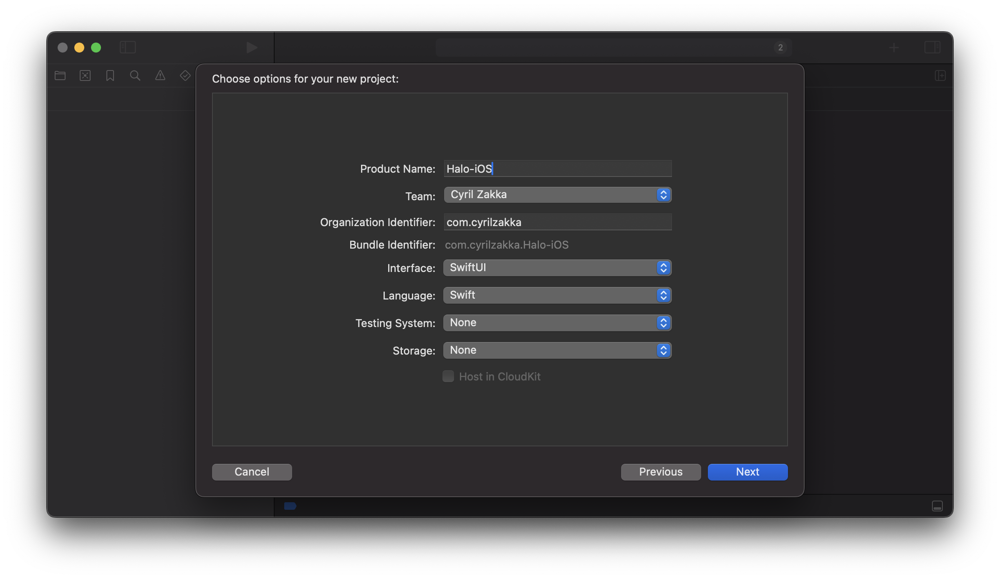
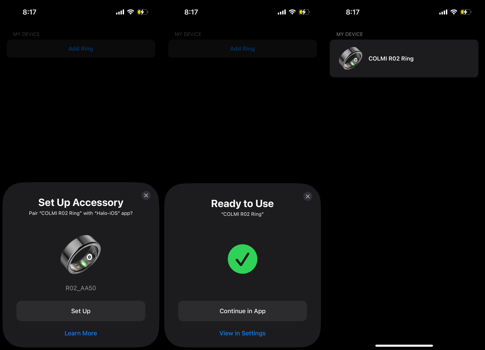

# Chapter 1: Pairing the Ring
Before we dive into the code, let's understand some key specifications of Bluetooth Low Energy (BLE) first. BLE operates on a simple client-server model using three key concepts: _Centrals_, _Services_, and _Characteristics_. Let's break these down:
- A **Central device** (like your iPhone) initiates and manages connections with a **Peripheral device** (like our COLMI R02 ring). The ring broadcasts its presence, waiting for a phone to connect to it. Only one phone can connect to the ring at a time.
- **Services** are collections of related features on the ring. Think of them as categories - one service might handle heart rate monitoring, another handles battery status. Each service has a unique identifier (UUID) that the client uses to find it.
- **Characteristics** are the actual data points or control mechanisms within each service. They can be read-only (like getting sensor data), write-only (like sending commands), or both. Some characteristics can also notify your phone automatically when their values change, which is crucial for real-time health monitoring.

When your phone connects to the ring, it locates the services it needs and then interacts with specific characteristics to send commands or receive data. This structured approach ensures efficient communication while maintaining long battery life. With these details out of the way, let's get to building!


## Setting up the Xcode Project
Let's create a new project called `Halo` targeting `iOS`. For the organization identifier, it's customary to use a reverse domain name (like `com.example`). We'll use `com.FirstNameLastName` for this project.

.

We now need to enable specific capabilities for our app. Go to the `Signing & Capabilities` tab in Xcode and enable the following `Background Modes`:


These settings ensure your app can maintain connections with the ring and process data even when it's not in the foreground. 

In the next step, we'll make use of a framework called [`AccessorySetupKit`](https://developer.apple.com/documentation/accessorysetupkit/) - Apple's latest framework for connecting Bluetooth and Wi-Fi accessories to iOS apps. Released with iOS 18, it replaces the traditional method of requesting broad Bluetooth permissions with a more focused approach - your app only gets access to specific devices that users explicitly approve. 

When a user wants to connect their COLMI R02 ring to our app, `AccessorySetupKit` presents a system interface showing only compatible nearby devices. Once selected, our app can communicate with the ring without requiring full Bluetooth access to the user's device. This means better privacy for users and simpler connection management for developers.
Let's walk through setting up `AccessorySetupKit` for our ring.

First open up `Info.plist` which you can either find in the left sidebar, or by navigating to `Project Navigator (⌘1) > Your Target > Info`. Now enter the following key-value entries to work with our COLMI R02 ring:

- Add `NSAccessorySetupKitSupports` as an `Array` type and Insert `Bluetooth` as its first item
- Add `NSAccessorySetupBluetoothServices` as an `Array` type and these UUIDs as `String` items `6E40FFF0-B5A3-F393-E0A9-E50E24DCCA9E` and `0000180A-0000-1000-8000-00805F9B34FB`.


We should now be good to go! 🤗

> If you prefer to skip the setup and jump straight to the code, you can find the [full code below](#full-code)

## Ring Session Manager
First, we'll create a `RingSessionManager` class that handles all the ring communication. This class will be responsible for:
- Scanning for nearby rings
- Connecting to a ring
- Discovering services and characteristics
- Reading and writing data to the ring

### Step 1: Create the RingSessionManager
Create a new Swift (⌘N) file named `RingSessionManager.swift`. I've highlighted the key properties and methods you'll need to implement below. You'll find the full class at the end of this section. Let's start by defining the class and its properties:
<details>
<summary>Click to expand</summary>

```swift
@Observable
class RingSessionManager: NSObject {
    // Track connection state
    var peripheralConnected = false
    var pickerDismissed = true
    
    // Store our connected ring
    var currentRing: ASAccessory?
    private var session = ASAccessorySession()
    
    // Core Bluetooth objects
    private var manager: CBCentralManager?
    private var peripheral: CBPeripheral?
}
```
</details>


### Step 2: Discovering the Ring

The ring broadcasts itself using specific Bluetooth services. We need to tell iOS what to look for. We'll create a `ASDiscoveryDescriptor` object with the ring's Bluetooth service UUID. This descriptor will help `AccessorySetupKit` identify the ring when scanning for nearby devices:

<details>
<summary>Click to expand</summary>

```swift
private static let ring: ASPickerDisplayItem = {
    let descriptor = ASDiscoveryDescriptor()
    descriptor.bluetoothServiceUUID = CBUUID(string: "6E40FFF0-B5A3-F393-E0A9-E50E24DCCA9E")
    
    return ASPickerDisplayItem(
        name: "COLMI R02 Ring",
        productImage: UIImage(named: "colmi")!,
        descriptor: descriptor
    )
}()
```
</details>

You can replace the `UIImage(named: "colmi")!` with your ring's image. Make sure to add the image to your project's asset catalog. I used the following [product](https://www.colmi.info/cdn/shop/files/SmartRingCOLMIR02Black1.jpg?v=1706523978&width=990) image.

### Step 3: Showing the Ring Picker
When the user wants to connect their ring, we show Apple's built-in device picker:

<details>
<summary>Click to expand</summary>

```swift
func presentPicker() {
    session.showPicker(for: [Self.ring]) { error in
        if let error {
            print("Failed to show picker: \(error.localizedDescription)")
        }
    }
}
```
</details>


### Step 4: Handling Ring Selection
When the user picks their ring from the list, we need to handle the connection:

<details>
<summary>Click to expand</summary>

```swift
private func handleSessionEvent(event: ASAccessoryEvent) {
    switch event.eventType {
    case .accessoryAdded:
        guard let ring = event.accessory else { return }
        saveRing(ring: ring)
        
    case .activated:
        // Handle reconnection to previously paired ring
        guard let ring = session.accessories.first else { return }
        saveRing(ring: ring)
        
    case .accessoryRemoved:
        currentRing = nil
        manager = nil
    }
}
```
</details>


### Step 5: Establishing the Connection
Once we have a ring selected, we initiate the actual Bluetooth connection:

<details>
<summary>Click to expand</summary>

```swift
func connect() {
    guard
        let manager, manager.state == .poweredOn,
        let peripheral
    else {
        return
    }
    
    let options: [String: Any] = [
        CBConnectPeripheralOptionNotifyOnConnectionKey: true,
        CBConnectPeripheralOptionNotifyOnDisconnectionKey: true,
        CBConnectPeripheralOptionStartDelayKey: 1
    ]
    manager.connect(peripheral, options: options)
}
```
</details>


### Step 6: Understanding the Delegate Methods
Our `RingSessionManager` implements two crucial delegate protocols that handle Bluetooth communication. Let's explore what each delegate method does:

#### The Central Manager Delegate
First, we implement `CBCentralManagerDelegate` to handle the overall Bluetooth connection state:

<details>
<summary>Click to expand</summary>

```swift
func centralManagerDidUpdateState(_ central: CBCentralManager) {
    print("Central manager state: \(central.state)")
    switch central.state {
    case .poweredOn:
        if let peripheralUUID = currentRing?.bluetoothIdentifier {
            if let knownPeripheral = central.retrievePeripherals(withIdentifiers: [peripheralUUID]).first {
                print("Found previously connected peripheral")
                peripheral = knownPeripheral
                peripheral?.delegate = self
                connect()
            } else {
                print("Known peripheral not found, starting scan")
            }
        }
    default:
        peripheral = nil
    }
}
```

</details>


This method gets called whenever the Bluetooth state changes on the device. When Bluetooth powers on, we check if we have a previously connected ring and try to reconnect to it.
When we successfully connect to a ring, this method gets called:

<details>
<summary>Click to expand</summary>

```swift
func centralManager(_ central: CBCentralManager, didConnect peripheral: CBPeripheral) {
    print("DEBUG: Connected to peripheral: \(peripheral)")
    peripheral.delegate = self
    print("DEBUG: Discovering services...")
    peripheral.discoverServices([CBUUID(string: Self.ringServiceUUID)])
    
    peripheralConnected = true
}
```
</details>

And when the ring disconnects (either intentionally or by going out of range):

<details>
<summary>Click to expand</summary>

```swift
func centralManager(_ central: CBCentralManager, didDisconnectPeripheral peripheral: CBPeripheral, error: (any Error)?) {
    print("Disconnected from peripheral: \(peripheral)")
    peripheralConnected = false
    characteristicsDiscovered = false
}
```
</details>


#### The Peripheral Delegate
The `CBPeripheralDelegate` methods handle the actual communication with our ring. First, we discover the ring's services:

<details>
<summary>Click to expand</summary>

```swift
func peripheral(_ peripheral: CBPeripheral, didDiscoverServices error: (any Error)?) {
    print("DEBUG: Services discovery callback, error: \(String(describing: error))")
    guard error == nil, let services = peripheral.services else {
        print("DEBUG: No services found or error occurred")
        return
    }
    
    print("DEBUG: Found \(services.count) services")
    for service in services {
        if service.uuid == CBUUID(string: Self.ringServiceUUID) {
            print("DEBUG: Found ring service, discovering characteristics...")
            peripheral.discoverCharacteristics([
                CBUUID(string: Self.uartRxCharacteristicUUID),
                CBUUID(string: Self.uartTxCharacteristicUUID)
            ], for: service)
        }
    }
}
```

</details>

Once we find the services, we need to discover their characteristics - these are the actual data points we can read from or write to:

<details>
<summary>Click to expand</summary>

```swift
func peripheral(_ peripheral: CBPeripheral, didDiscoverCharacteristicsFor service: CBService, error: Error?) {
    print("DEBUG: Characteristics discovery callback, error: \(String(describing: error))")
    guard error == nil, let characteristics = service.characteristics else {
        print("DEBUG: No characteristics found or error occurred")
        return
    }
    
    print("DEBUG: Found \(characteristics.count) characteristics")
    for characteristic in characteristics {
        switch characteristic.uuid {
        case CBUUID(string: Self.uartRxCharacteristicUUID):
            print("DEBUG: Found UART RX characteristic")
            self.uartRxCharacteristic = characteristic
        case CBUUID(string: Self.uartTxCharacteristicUUID):
            print("DEBUG: Found UART TX characteristic")
            self.uartTxCharacteristic = characteristic
            peripheral.setNotifyValue(true, for: characteristic)
        default:
            print("DEBUG: Found other characteristic: \(characteristic.uuid)")
        }
    }
    characteristicsDiscovered = true
}
```

</details>

When we receive data from the ring, this method gets called:

<details>
<summary>Click to expand</summary>

```swift
func peripheral(_ peripheral: CBPeripheral, didUpdateValueFor characteristic: CBCharacteristic, error: Error?) {
    if characteristic.uuid == CBUUID(string: Self.uartTxCharacteristicUUID) {
        if let value = characteristic.value {
            print("Received value: \(value)")
        }
    }
}
```
</details>

And finally, when we send commands to the ring, this callback confirms if they were received:

<details>
<summary>Click to expand</summary>

```swift
func peripheral(_ peripheral: CBPeripheral, didWriteValueFor characteristic: CBCharacteristic, error: Error?) {
    if let error = error {
        print("Write to characteristic failed: \(error.localizedDescription)")
    } else {
        print("Write to characteristic successful")
    }
}
```
</details>

### Full Code
The full `RingSessionManager` class should now look like this:
<details>
<summary>Full Code</summary>

```swift
import Foundation
import AccessorySetupKit
import CoreBluetooth
import SwiftUI

@Observable
class RingSessionManager: NSObject {
    var peripheralConnected = false
    var pickerDismissed = true
    
    var currentRing: ASAccessory?
    private var session = ASAccessorySession()
    private var manager: CBCentralManager?
    private var peripheral: CBPeripheral?
    
    private var uartRxCharacteristic: CBCharacteristic?
    private var uartTxCharacteristic: CBCharacteristic?
    
    private static let ringServiceUUID = "6E40FFF0-B5A3-F393-E0A9-E50E24DCCA9E"
    private static let uartRxCharacteristicUUID = "6E400002-B5A3-F393-E0A9-E50E24DCCA9E"
    private static let uartTxCharacteristicUUID = "6E400003-B5A3-F393-E0A9-E50E24DCCA9E"
    
    private static let deviceInfoServiceUUID = "0000180A-0000-1000-8000-00805F9B34FB"
    private static let deviceHardwareUUID = "00002A27-0000-1000-8000-00805F9B34FB"
    private static let deviceFirmwareUUID = "00002A26-0000-1000-8000-00805F9B34FB"
    
    private static let ring: ASPickerDisplayItem = {
        let descriptor = ASDiscoveryDescriptor()
        descriptor.bluetoothServiceUUID = CBUUID(string: ringServiceUUID)
        
        return ASPickerDisplayItem(
            name: "COLMI R02 Ring",
            productImage: UIImage(named: "colmi")!,
            descriptor: descriptor
        )
    }()
    
    private var characteristicsDiscovered = false
    
    override init() {
        super.init()
        self.session.activate(on: DispatchQueue.main, eventHandler: handleSessionEvent(event:))
    }
    
    // MARK: - RingSessionManager actions
    func presentPicker() {
        session.showPicker(for: [Self.ring]) { error in
            if let error {
                print("Failed to show picker due to: \(error.localizedDescription)")
            }
        }
    }
    
    func removeRing() {
        guard let currentRing else { return }
        
        if peripheralConnected {
            disconnect()
        }
        
        session.removeAccessory(currentRing) { _ in
            self.currentRing = nil
            self.manager = nil
        }
    }
    
    func connect() {
        guard
            let manager, manager.state == .poweredOn,
            let peripheral
        else {
            return
        }
        let options: [String: Any] = [
            CBConnectPeripheralOptionNotifyOnConnectionKey: true,
            CBConnectPeripheralOptionNotifyOnDisconnectionKey: true,
            CBConnectPeripheralOptionStartDelayKey: 1
        ]
        manager.connect(peripheral, options: options)
    }
    
    func disconnect() {
        guard let peripheral, let manager else { return }
        manager.cancelPeripheralConnection(peripheral)
    }
    
    // MARK: - ASAccessorySession functions
    private func saveRing(ring: ASAccessory) {
        currentRing = ring
        
        if manager == nil {
            manager = CBCentralManager(delegate: self, queue: nil)
        }
    }
    
    private func handleSessionEvent(event: ASAccessoryEvent) {
        switch event.eventType {
        case .accessoryAdded, .accessoryChanged:
            guard let ring = event.accessory else { return }
            saveRing(ring: ring)
        case .activated:
            guard let ring = session.accessories.first else { return }
            saveRing(ring: ring)
        case .accessoryRemoved:
            self.currentRing = nil
            self.manager = nil
        case .pickerDidPresent:
            pickerDismissed = false
        case .pickerDidDismiss:
            pickerDismissed = true
        default:
            print("Received event type \(event.eventType)")
        }
    }
}

// MARK: - CBCentralManagerDelegate
extension RingSessionManager: CBCentralManagerDelegate {
    func centralManagerDidUpdateState(_ central: CBCentralManager) {
        print("Central manager state: \(central.state)")
        switch central.state {
        case .poweredOn:
            if let peripheralUUID = currentRing?.bluetoothIdentifier {
                if let knownPeripheral = central.retrievePeripherals(withIdentifiers: [peripheralUUID]).first {
                    print("Found previously connected peripheral")
                    peripheral = knownPeripheral
                    peripheral?.delegate = self
                    connect()
                } else {
                    print("Known peripheral not found, starting scan")
                }
            }
        default:
            peripheral = nil
        }
    }
    
    func centralManager(_ central: CBCentralManager, didConnect peripheral: CBPeripheral) {
        print("DEBUG: Connected to peripheral: \(peripheral)")
        peripheral.delegate = self
        print("DEBUG: Discovering services...")
        peripheral.discoverServices([CBUUID(string: Self.ringServiceUUID)])
        
        peripheralConnected = true
    }
    
    func centralManager(_ central: CBCentralManager, didDisconnectPeripheral peripheral: CBPeripheral, error: (any Error)?) {
        print("Disconnected from peripheral: \(peripheral)")
        peripheralConnected = false
        characteristicsDiscovered = false
    }
    
    func centralManager(_ central: CBCentralManager, didFailToConnect peripheral: CBPeripheral, error: (any Error)?) {
        print("Failed to connect to peripheral: \(peripheral), error: \(error.debugDescription)")
    }
}

// MARK: - CBPeripheralDelegate
extension RingSessionManager: CBPeripheralDelegate {
    func peripheral(_ peripheral: CBPeripheral, didDiscoverServices error: (any Error)?) {
        print("DEBUG: Services discovery callback, error: \(String(describing: error))")
        guard error == nil, let services = peripheral.services else {
            print("DEBUG: No services found or error occurred")
            return
        }
        
        print("DEBUG: Found \(services.count) services")
        for service in services {
            if service.uuid == CBUUID(string: Self.ringServiceUUID) {
                print("DEBUG: Found ring service, discovering characteristics...")
                peripheral.discoverCharacteristics([
                    CBUUID(string: Self.uartRxCharacteristicUUID),
                    CBUUID(string: Self.uartTxCharacteristicUUID)
                ], for: service)
            }
        }
    }
    
    func peripheral(_ peripheral: CBPeripheral, didDiscoverCharacteristicsFor service: CBService, error: Error?) {
        print("DEBUG: Characteristics discovery callback, error: \(String(describing: error))")
        guard error == nil, let characteristics = service.characteristics else {
            print("DEBUG: No characteristics found or error occurred")
            return
        }
        
        print("DEBUG: Found \(characteristics.count) characteristics")
        for characteristic in characteristics {
            switch characteristic.uuid {
            case CBUUID(string: Self.uartRxCharacteristicUUID):
                print("DEBUG: Found UART RX characteristic")
                self.uartRxCharacteristic = characteristic
            case CBUUID(string: Self.uartTxCharacteristicUUID):
                print("DEBUG: Found UART TX characteristic")
                self.uartTxCharacteristic = characteristic
                peripheral.setNotifyValue(true, for: characteristic)
            default:
                print("DEBUG: Found other characteristic: \(characteristic.uuid)")
            }
        }
        characteristicsDiscovered = true
    }
    
    func peripheral(_ peripheral: CBPeripheral, didUpdateValueFor characteristic: CBCharacteristic, error: Error?) {
        if characteristic.uuid == CBUUID(string: Self.uartTxCharacteristicUUID) {
            if let value = characteristic.value {
                print("Received value: \(value)")
            }
        }
    }
    
    func peripheral(_ peripheral: CBPeripheral, didWriteValueFor characteristic: CBCharacteristic, error: Error?) {
        if let error = error {
            print("Write to characteristic failed: \(error.localizedDescription)")
        } else {
            print("Write to characteristic successful")
        }
    }
}
```
</details>

### Step 7: Making it Work in Our App
Open up `ContentView.swift` and paste the following. Everything should now be in place!

<details>
<summary>Click to expand</summary>

```swift
import SwiftUI
import AccessorySetupKit

struct ContentView: View {
    @State var ringSessionManager = RingSessionManager()
    
    var body: some View {
        List {
            Section("MY DEVICE", content: {
                if ringSessionManager.pickerDismissed, let currentRing = ringSessionManager.currentRing {
                    makeRingView(ring: currentRing)
                } else {
                    Button {
                        ringSessionManager.presentPicker()
                    } label: {
                        Text("Add Ring")
                            .frame(maxWidth: .infinity)
                            .font(Font.headline.weight(.semibold))
                    }
                }
            })
        }.listStyle(.insetGrouped)
        
    }
    
    @ViewBuilder
    private func makeRingView(ring: ASAccessory) -> some View {
        HStack {
            Image("colmi")
                .resizable()
                .aspectRatio(contentMode: .fit)
                .frame(height: 70)
            
            VStack(alignment: .leading) {
                Text(ring.displayName)
                    .font(Font.headline.weight(.semibold))
            }
        }
    }
}

#Preview {
    ContentView()
}
```
</details>

If all goes well, you should now be able to build and run your app. When you tap the `Add Ring` button, you'll see a pop-up of nearby devices including your COLMI R02 ring. Select it and the app will connect to it. 🎉 



In the next chapter, we'll explore how to read and write data to the ring, starting with battery level, and working our way to raw sensor data (photoplethysmogram, accelerometer, etc). We'll then use this data to build features like real-time heart rate monitoring, activity tracking, sleep phase detection and more. Stay tuned!
